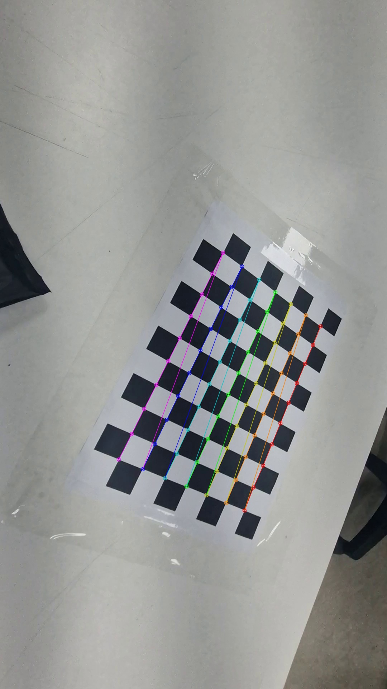
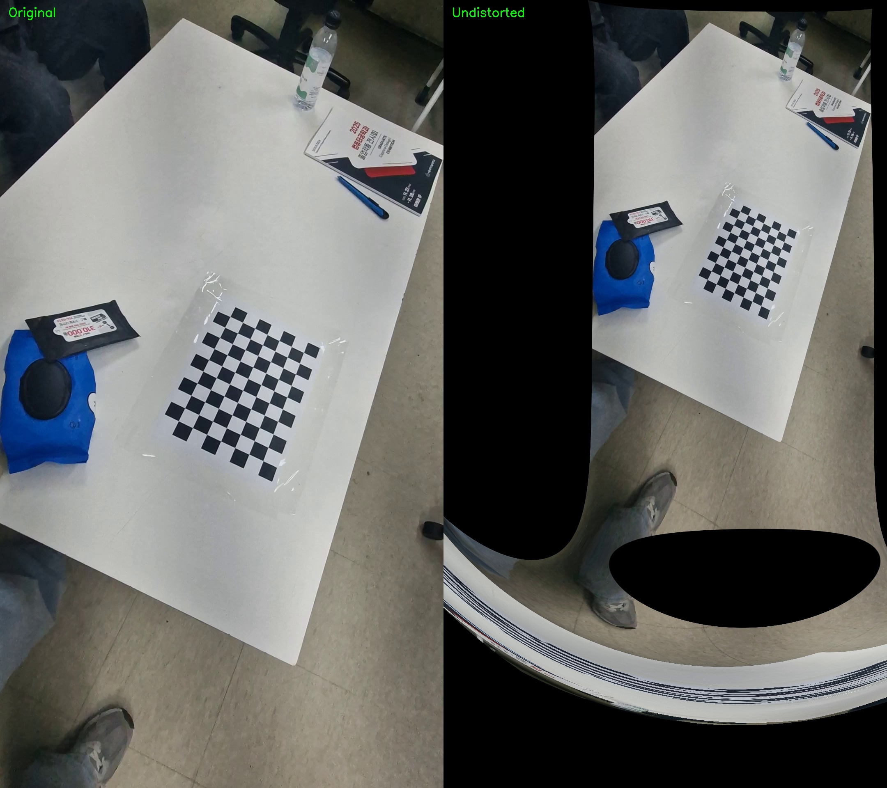

# Camera Calibration and Distortion Correction with OpenCV

This project performs camera calibration using a checkerboard pattern and applies lens distortion correction based on the estimated camera parameters.

The goal is to estimate the intrinsic camera matrix and distortion coefficients from multiple checkerboard images, then use them to rectify distorted images captured by the same camera.

---

## Overview

The project consists of the following steps:

1. Capture a checkerboard video from multiple viewpoints
2. Extract usable frames from the video
3. Detect checkerboard corners in each frame
4. Perform camera calibration with OpenCV
5. Apply distortion correction using the estimated parameters

---

## Checkerboard Settings

The following checkerboard configuration was used for calibration:

* **Inner corners**: `10 x 7`
* **Cell size**: `25.0 mm`

```python
board_pattern = (10, 7)
board_cellsize = 25.0
```

---

## Requirements

Install the required packages with:

```bash
pip install opencv-python numpy
```

Or use:

```bash
pip install -r requirements.txt
```

---

## 1. Frame Extraction

Frames are extracted from the calibration video and saved into `data/selected/`.

Run:

```bash
python src/capture_frames.py
```

This script samples frames from the checkerboard video for later corner detection.

---

## 2. Checkerboard Corner Detection

Checkerboard corners are detected from the extracted frames using OpenCV.

Run:

```bash
python src/camera_calibration.py
```

This script:

* loads checkerboard images
* detects checkerboard corners
* refines corner locations with sub-pixel accuracy
* stores valid object points and image points
* performs camera calibration

---

## Checkerboard Corner Detection Result

Example of successful checkerboard corner detection:



---

## 3. Camera Calibration Result

The camera was calibrated using multiple checkerboard images.

### RMS Reprojection Error

```text
0.6887958376694803
```

### Camera Matrix

```text
[[970.199798   0.       554.873799]
 [  0.       963.270873 950.035093]
 [  0.         0.         1.      ]]
```

### Distortion Coefficients

```text
[[-0.020841  0.088206 -0.009084  0.007036 -0.068789]]
```

> The exact numerical results are stored in `results/calibration_result.txt`.

---

## 4. Distortion Correction

After calibration, the estimated parameters were used to undistort an image captured by the same camera.

Run:

```bash
python src/distortion_correction.py
```

This script applies:

* `cv2.getOptimalNewCameraMatrix()`
* `cv2.undistort()`

to generate the corrected image.

---

## Distortion Correction Result

Comparison between the original image and the undistorted result:



---

## Notes

* `undistorted.jpg` preserves the corrected image with the original frame size
* `undistorted_cropped.jpg` removes invalid black border regions after undistortion
* The comparison image in this README uses the **original image** and the **undistorted image**

---

## Summary

This project demonstrates the complete camera calibration pipeline using a checkerboard pattern in OpenCV.

Through this process, it is possible to:

* estimate intrinsic camera parameters
* model lens distortion
* correct distorted images for more accurate computer vision processing